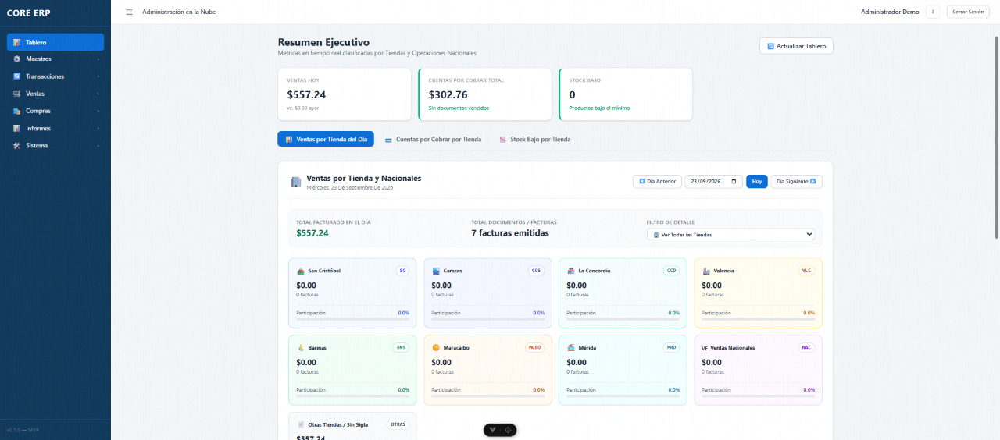
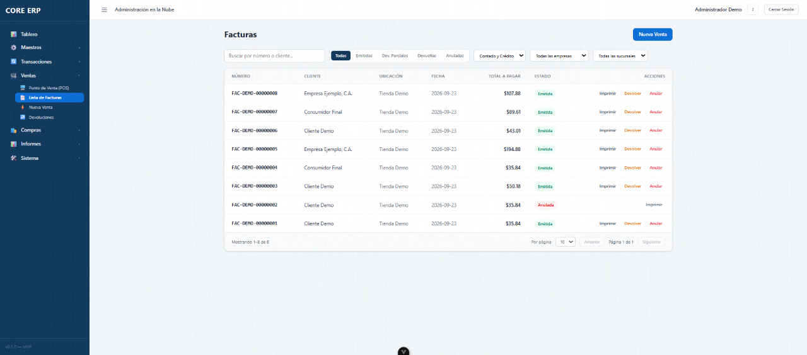
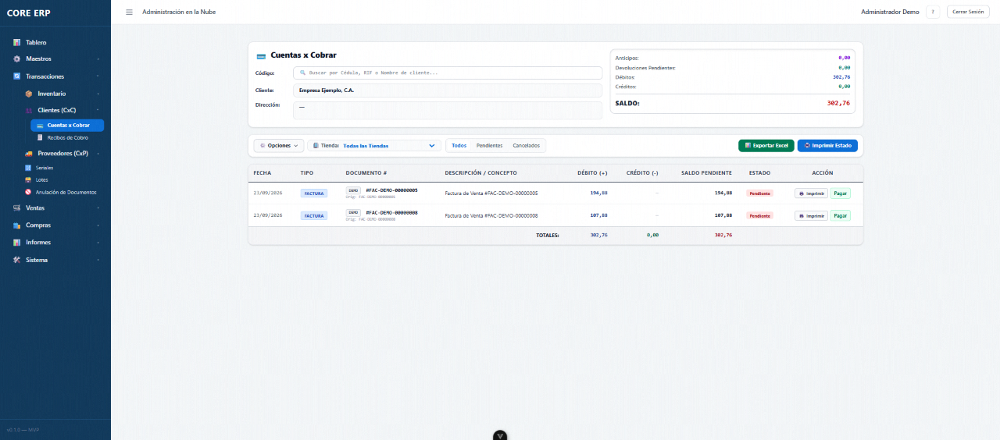
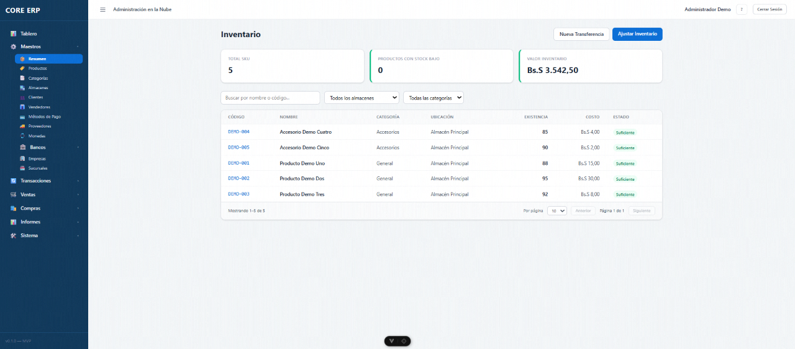

# ERP Business — Multi-branch ERP & Point of Sale

**A full-stack retail ERP: invoicing, inventory, accounts receivable and a POS terminal for multi-branch, multi-currency businesses.**
Built with **NestJS + PostgreSQL** and **Vue 3 + TypeScript**. This repository is a sanitized demo: no real data, and it runs end to end in a few commands.

`NestJS 11` · `TypeORM` · `PostgreSQL` · `Vue 3` · `Pinia` · `Tailwind CSS 4` · `Vite` · `JWT` · `Swagger`

> 🇪🇸 [Versión en español](README.es.md)



## What it does

A single sale **drives everything downstream**: it decrements stock, creates the receivable when sold on credit, and shows up on the executive dashboard.

| | |
|---|---|
|  |  |
| **Sales & invoicing** — issue, void, return; cash or credit | **Accounts receivable** — credit sales create the receivable automatically |


*Inventory — stock per warehouse, transfers, adjustments, kardex. Stock drops as invoices are issued.*

## Highlights

- **Closed transactional loop** — login → invoice → stock decrement → receivable → void restores stock. Verified by an automated smoke test (`backend/scripts/smoke-test.js`).
- **Business rules enforced in the database** — PostgreSQL triggers keep inventory and receivables consistent (10 triggers backed by 15 functions), so no client can leave them out of sync.
- **Multi-currency** — USD / VES / COP with exchange rates, per-currency price lists (17 price tiers) and IGTF tax handling.
- **Multi-branch** — branches, warehouses, per-branch document numbering and branch-scoped permissions, plus national-level roles.
- **Role-based access control** — 70 granular permissions across 9 roles, embedded in the JWT and enforced in both API and UI.
- **POS terminal** — separate cashier area with shift opening, supervisor override for sensitive actions and live multi-currency totals.
- **Back-office modules** — purchases, accounts payable, receipts, returns, document voiding, inventory transformations, serials and lots, Excel price import/export, reports.

## Scale

| | |
|---|---|
| REST endpoints | ~200 across 37 modules (Swagger at `/api/docs`) |
| Database | 46 tables, 42 mapped entities |
| Frontend | 85 views, 37 Pinia stores, ~45k lines of TypeScript/Vue |
| Backend | ~15k lines of TypeScript |

## Architecture

```
┌─────────────────────┐  REST + JWT  ┌─────────────────────┐   SQL   ┌──────────────────────┐
│ Vue 3 + Pinia SPA   │ ───────────► │ NestJS API (/api)   │ ──────► │ PostgreSQL           │
│ (POS + back office) │ ◄─────────── │ DTO validation      │ ◄────── │ schema + triggers    │
└─────────────────────┘              │ RBAC guards         │         │ (stock, receivables) │
                                     └─────────────────────┘         └──────────────────────┘
```

The schema is managed with plain SQL (`backend/db/schema.sql`, `synchronize: false`), so database logic is versioned and reviewable.

## Run it locally (5 minutes)

**Requirements:** Node.js 20+, pnpm, PostgreSQL 16+ (Python 3 + `openpyxl` only for the Excel price import/export).

```bash
# 1. Database
createdb erp_business_demo
psql erp_business_demo -v ON_ERROR_STOP=1 -f backend/db/schema.sql
psql erp_business_demo -v ON_ERROR_STOP=1 -f backend/db/seed.sql

# 2. Backend  →  http://localhost:3000/api  (Swagger: /api/docs)
cd backend
cp .env.example .env          # set DATABASE_URL and JWT_SECRET
pnpm install && pnpm run start:dev

# 3. Verify the whole flow (API running)
node scripts/smoke-test.js    # login → invoice → stock → void → stock restored

# 4. Frontend  →  http://localhost:5173
cd ../frontend-vue/erp-business-frontend
pnpm install && pnpm run dev
```

**Demo users** (password `Demo1234!`): `admin` (full access) and `cajero` (cashier). The UI is in Spanish.

The seed loads the app configuration (permissions, roles, price tiers, banks, payment methods) plus fictitious data: one company/branch/warehouse, 5 products, 3 customers, 2 sellers and starting stock. Demo rate: 1 USD = 100 Bs.

## Repository layout

```
backend/                 NestJS API
  src/<module>/          controller · service · DTOs · entity (one folder per domain)
  db/schema.sql          full PostgreSQL schema (tables, triggers, indexes)
  db/seed.sql            configuration + demo data
  scripts/smoke-test.js  end-to-end flow check
frontend-vue/…/src/modules/   feature modules: invoices, inventory, customers, cuentas-cobrar, …
docs/                    API endpoint manual, requirements
```

## Notes

- Sanitized for public viewing: no real customers, credentials or business data. **Change the demo passwords before exposing it anywhere.**
- More detail: [`docs/API_ENDPOINTS_MANUAL.md`](docs/API_ENDPOINTS_MANUAL.md), [`CONTRIBUTING.md`](CONTRIBUTING.md).
